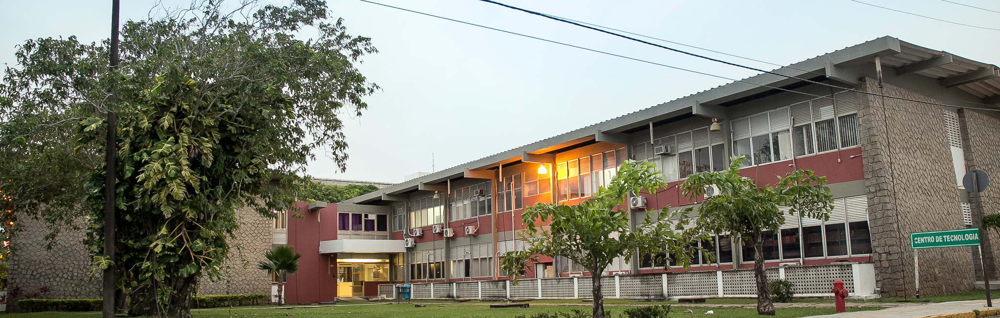

# Federal University of Rio Grande do Norte
## Technology Center
### Department of Computer Engineering and Automation 
#### Algorithms and Data Structure II

#### References

- :books: Menczer, Filippo; Fortunato, Santo; A. Davis, Clayton. A First Course in Network Science [[Link]](https://www.cambridge.org/us/academic/subjects/physics/statistical-physics/first-course-network-science)
- :books: Dmitry Zinoviev. Complex Network Analysis in Python [[Link]](https://pragprog.com/titles/dzcnapy/complex-network-analysis-in-python/)
- :books: Coscia, Michele. The Atlas for the Aspiring Network Scientist [[Link]](https://www.networkatlas.eu/)

#### Lessons

**Week 01**: Course Outline 
- Git and Version Control 
    - You'll learn how to: a) organize your code using version control, b) resolve conflicts in version control, c) employ Git and Github to collaborate with others.
    - :facepunch: getting a git repository.